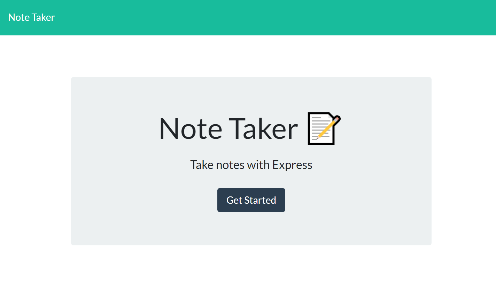

# Note Taker

---

## Description 

*Description of the project; including the what, the why and the how:* 

Note Taker that can be used to write and save notes. This application will use an Express.js back end and will save and retrieve note data from a JSON file. Delete and edit functionality is not included at this time. The starter code was retreived in class. 

## Table of Contents
* [Installation](#installation)
* [Usage](#usage)
* [Contributing](#contributing)
* [Tests](#tests)
* [License](#license)
---

## Installation

*Instructions required to install and run the project:*

* Clone the github respository
* Install the necessesary node modules (identified in the package.json file)
* Application can then be invoked via the node index.js command or via the heroku deployment

---

## Usage 

Express.js back end and will save and retrieve note data from a JSON file

## Preview
 
 
[Visit the deployed site here!](https://drive.google.com/file/d/1sIGcl74jkarz6SYc0q0CftVQC_vjzR2m/view)
---

## Tests

*Tests used and how they are ran:*

---

## License

undefined

---

## Questions?

For any questions, please feel free to reach out to me:

GitHub: [@asanchez325](https://api.github.com/users/asanchez325)